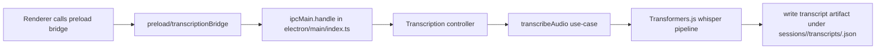

## Goal

Reduce `electron/main/index.ts` from its current size to ~600 lines by extracting the IPC registration/handler logic into dedicated modules.

## Success Criteria

- `electron/main/index.ts` drops to ~600 lines **excluding logging statements** (logging points remain at the same semantics).
- For each extracted unit of logic (parsers/guards/normalizers/use-cases), add unit tests *before* moving the code.
- After each migration slice, run the existing test suite and `pnpm typecheck` and verify log output for transcription/model-init wiring.

## Approach (incremental)

1. Start with the transcription IPC handler block currently in `electron/main/index.ts` (roughly `1046-1184`):
  - Extract request validation into a guard.
  - Extract Whisper output normalization into a pure function.
  - Extract transcript artifact building + disk persistence into a use-case.
  - Wrap those pieces in a controller that returns the `ipcMain.handle` handler.
2. Add unit tests for each extracted pure function/use-case with mocked model pipelines.
3. Replace the inline handler with the controller.
4. Repeat the same pattern for the next-largest IPC groupings until file size target is met:
  - `MODEL_INIT_CHANNELS.`*
  - `WINDOW_REGISTRY_CHANNELS.`*
  - `SHORTCUTS_IPC_CHANNELS.`*
  - `CAPTURE_OPTIONS_CHANNELS.`*
  - `AI_PROVIDER_CHANNELS.`*
  - `WINDOW_CONTROL_CHANNELS.`*
5. Keep log.ger calls where they currently are (or move them only inside the extracted modules without changing the emitted payload keys), so existing debugging remains valid.

## Mermaid (high level)

## Implementation Notes

- New guard/normalization helpers should live under `src/backend/guards/*` (continuing the `checks.ts` pattern, but per-topic guard modules for anything non-trivial).
- New business logic should live under `src/backend/application/use-cases/*`.
- New IPC adaptation should live under `src/backend/interfaces/controllers/*` as controller factories that return an `ipcMain.handle`-compatible function.
- Unit tests should live under `src/backend/test/*` and run via the existing `node --test dist-electron/src/backend/test/*.test.js` script (no jest switch).

