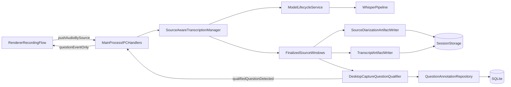

# Main-Process Streaming Transcription Plan

## Goal

Shift from per-chunk request/response ASR to a session-scoped, source-aware audio stream in the Electron main process. The pipeline should continuously transcribe audio by source, qualify questions asked on `desktop-capture`, send those qualified questions back to the renderer, and still persist diarization-like source segments plus final transcript artifacts to disk.

## Current Baseline

- Model pipeline creation/caching is centralized in `[E:/interview-sentiment-analyzer/src/backend/infrastructure/ml/model-lifecycle-service.ts](E:/interview-sentiment-analyzer/src/backend/infrastructure/ml/model-lifecycle-service.ts)`.
- Active transcription path is still inline in `[E:/interview-sentiment-analyzer/electron/main/index.ts](E:/interview-sentiment-analyzer/electron/main/index.ts)` via `transcription.transcribeAudio` IPC handler.
- The renderer currently decodes each persisted audio chunk and calls `window.electronApp.transcription.transcribeAudio(...)` from `[E:/interview-sentiment-analyzer/src/renderer/hooks/useRecordingSession.ts](E:/interview-sentiment-analyzer/src/renderer/hooks/useRecordingSession.ts)`.
- Capture sources are already explicit in shared types (`microphone`, `system-audio`, `desktop-capture`) in `[E:/interview-sentiment-analyzer/src/shared/session-lifecycle.ts](E:/interview-sentiment-analyzer/src/shared/session-lifecycle.ts)`.
- `desktop-capture` may already contain mixed desktop + microphone audio depending on capture settings in `[E:/interview-sentiment-analyzer/src/renderer/recording/capture-manager.ts](E:/interview-sentiment-analyzer/src/renderer/recording/capture-manager.ts)`, so the first pass should treat diarization as source attribution, not true speaker separation inside one mixed stream.
- The downstream `annotate_questions` stage is currently a placeholder artifact writer in `[E:/interview-sentiment-analyzer/src/backend/infrastructure/providers/local-pipeline-analysis.ts](E:/interview-sentiment-analyzer/src/backend/infrastructure/providers/local-pipeline-analysis.ts)`, so qualified question detection needs to move earlier in the live transcription path if the renderer should receive it during recording.

## Implementation Plan

1. Replace transcript-return IPC with a source-aware stream contract

- Replace the single `transcribeAudio` request/response shape with a session-scoped stream lifecycle keyed by `sessionId` and `source` (`start`, `pushAudio`, `flush`, `stop`, `cancel`).
- Add a separate renderer-facing event contract for `qualifiedQuestionDetected`, rather than streaming all transcript output back to the UI.
- Keep finalized transcript artifact compatibility with `[E:/interview-sentiment-analyzer/src/shared/transcription.ts](E:/interview-sentiment-analyzer/src/shared/transcription.ts)` so downstream storage/layout conventions stay intact.

1. Build a source-aware transcription manager in the main process

- Create a dedicated manager under `src/backend/infrastructure/ml/` that maintains rolling audio buffers per `sessionId + source`.
- Continue to obtain Whisper through `model-lifecycle-service.getPipeline(...)`, but invoke it over rolling/finalized source windows instead of one renderer IPC call per chunk.
- Introduce explicit utterance/window boundaries so the manager can decide when a source segment is stable enough to persist and qualify, without requiring token-by-token streaming to the renderer.
- Reuse `normalizeAsrOutput` so finalized text/segment shape stays consistent with current transcript artifacts.

1. Persist source-level diarization artifacts to file

- Add a new persisted artifact for source-attributed segments, for example one JSON file per finalized source window or a session-level append-only diarization log under session storage.
- Store source metadata (`desktop-capture`, `microphone`, `system-audio`), time bounds, transcript linkage, and confidence/qualification metadata so later pipeline stages can consume it.
- Keep this explicitly as source-level diarization for phase 1, not speaker identity inference inside a mixed source.

1. Move question qualification close to live desktop-capture transcription

- Add a desktop-capture-specific qualification step that runs when a finalized utterance/source window is produced.
- Qualify whether the utterance is a question and shape it into the existing question domain (`questionText`, `questionType`, timing, confidence, evidence), reusing `[E:/interview-sentiment-analyzer/src/backend/domain/question/question-annotation.ts](E:/interview-sentiment-analyzer/src/backend/domain/question/question-annotation.ts)` as the target entity.
- Persist qualified questions to the SQLite question annotation repository and/or question artifact files so final session outputs stay durable.
- Emit only qualified question events to the renderer so the UI gets actionable interviewer prompts without receiving all raw transcript segments.

1. Rewire main, preload, and renderer integration around question events

- In `[E:/interview-sentiment-analyzer/electron/main/index.ts](E:/interview-sentiment-analyzer/electron/main/index.ts)`, replace the current `transcribeAudio` invoke path with stream lifecycle handlers plus a question event publisher.
- In `[E:/interview-sentiment-analyzer/electron/preload/index.ts](E:/interview-sentiment-analyzer/electron/preload/index.ts)`, expose the new stream bridge and qualified-question event subscription.
- In `[E:/interview-sentiment-analyzer/src/renderer/hooks/useRecordingSession.ts](E:/interview-sentiment-analyzer/src/renderer/hooks/useRecordingSession.ts)`, keep sending source audio into the main process, but stop expecting a transcript result for every chunk. Instead, subscribe to qualified desktop-capture question events and update renderer state from those events.

1. Preserve stop-time flush and final artifact behavior

- On `stop`/`finalizeSession`, flush any remaining buffered audio per source so the last question/transcript windows are not lost.
- Continue writing finalized transcript JSON artifacts using the current builder path, but now derived from the source stream manager rather than direct chunk IPC calls.
- Ensure question qualification does not depend on the later placeholder `annotate_questions` stage.

1. Testing and regression coverage

- Add unit tests for stream state transitions per source (`start/push/flush/stop/cancel`), including desktop-capture-only qualification behavior.
- Add persistence tests for source-level diarization files and saved question annotations.
- Add integration coverage that verifies a desktop-capture utterance ending in a valid question produces a renderer event and durable file/repository records.
- Validate the current model init/caching path remains unchanged.

## Revised Data Flow

## Out of Scope (Explicit)

- True speaker diarization within a single mixed audio source.
- Token-by-token or partial transcript streaming to the renderer.
- Realtime transcript rendering for every source window.

