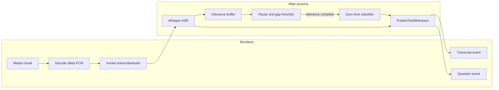

# ON-5: Pause-Aware Question Detection Addendum

## Goal

Shift live question detection from `per incoming chunk` to `per buffered utterance` so the classifier sees a fuller sentence and only evaluates after a meaningful pause or word-level gap.

## Current Constraint

The current flow triggers ASR and question detection on every decoded desktop chunk:

```79:156:src/renderer/hooks/useRecordingSession.ts
if (source === "desktop-capture") {
  void (async () => {
    const pcm = await chunkAccumulatorRef.current.decodeChunk(buffer);
    const transcription =
      await window.electronApp.transcription.transcribeAudio({
        source,
        pcmSamples: Array.from(pcm),
        sessionId,
        chunkId: result.chunkId,
      });
    // detection happens downstream today for this one chunk
  })();
}
```

And the controller runs question detection immediately after each ASR result:

```63:79:src/backend/interfaces/controllers/transcription-controller.ts
const transcription = await transcribeAudioUseCase({
  pcm,
  sessionId,
  chunkId,
  source,
});

const detectedQuestion = await detectLiveQuestionUseCase({
  sessionId,
  chunkId,
  source,
  text: transcription.text,
});
```

## Proposed Design

Keep `transcriptSegment` streaming as-is, but add a main-process utterance buffer keyed by `sessionId + source`.




## Implementation Steps

### 1. Add utterance-buffering domain in main process

Create a small shared/main helper responsible for accumulating chunk transcripts until a flush condition is met.

Files:

- `[src/shared/question-detection.ts](src/shared/question-detection.ts)`
- `[electron/main/index.ts](electron/main/index.ts)` or a new helper such as `[electron/main/live-question-buffer.ts](electron/main/live-question-buffer.ts)`

Buffer state should track:

- `sessionId`
- `source`
- ordered transcript fragments
- latest Whisper `chunks` timestamps from `[src/shared/transcription.ts](src/shared/transcription.ts)`
- first/last chunk ids in the utterance window
- wall-clock arrival times for fallback pause detection

### 2. Change question detection trigger from per chunk to per utterance

Refactor `[src/backend/interfaces/controllers/transcription-controller.ts](src/backend/interfaces/controllers/transcription-controller.ts)` so it:

- still returns `TranscriptionResult` for each chunk
- no longer treats each chunk transcript as the classification unit
- instead hands the chunk transcript + timestamps to the utterance buffer
- only calls `detectLiveQuestionUseCase()` when the buffer says the utterance is complete

Keep the ASR return path intact so live transcript rendering remains responsive.

### 3. Add pause/gap heuristics using Whisper timestamps first

Use the existing optional `chunks` timestamps from `[src/shared/transcription.ts](src/shared/transcription.ts)` as the primary signal.

Heuristic defaults to encode in the updated plan:

- require a minimum utterance text length before evaluating
- flush when there is a trailing pause after the final word span
- flush when a large inter-word gap appears near the tail
- flush on strong terminal punctuation fallback (`?`, `.`, `!`) when timing data is sparse
- force flush on session finalize/stop so no buffered question is lost

Keep thresholds centralized near `[src/backend/application/use-cases/detect-live-question.ts](src/backend/application/use-cases/detect-live-question.ts)` or in a dedicated helper so tuning is easy.

### 4. Broaden the classifier input from chunk text to utterance text

Update `[src/backend/application/use-cases/detect-live-question.ts](src/backend/application/use-cases/detect-live-question.ts)` to classify the buffered utterance string rather than a single chunk.

Adjust payload semantics in `[src/shared/question-detection.ts](src/shared/question-detection.ts)` as needed:

- keep `sessionId` and `source`
- consider carrying both `firstChunkId` and `lastChunkId` or an `utteranceId`
- continue exposing the final `text`, `questionScore`, and `nonQuestionScore`

### 5. Preserve transcript streaming, but clarify event semantics

Keep transcript UI fed by the existing transcript event path.

Files:

- `[src/shared/transcription.ts](src/shared/transcription.ts)`
- `[electron/main/index.ts](electron/main/index.ts)`
- `[src/renderer/hooks/useRecordingSession.ts](src/renderer/hooks/useRecordingSession.ts)`

The question event should now mean:

- `a pause-complete utterance was evaluated and classified as a question`

Not:

- `this raw 3s chunk happened to look like a question`

### 6. Reset/flush buffer on lifecycle boundaries

Hook the utterance buffer into session lifecycle boundaries so state does not leak between sessions.

Files:

- `[electron/main/index.ts](electron/main/index.ts)`
- any session-finalize callback path already used by recording/session lifecycle handlers

Behaviors:

- clear buffer on new session start
- flush pending utterance on stop/finalize
- clear per-session buffer after flush or session completion

### 7. Expand tests around aggregation and pause semantics

Add tests beyond the current threshold-only coverage.

Files:

- `[src/backend/test/detect-live-question.test.ts](src/backend/test/detect-live-question.test.ts)`
- `[src/backend/test/transcription-controller.test.ts](src/backend/test/transcription-controller.test.ts)`
- new helper test if buffer is extracted, e.g. `[src/backend/test/live-question-buffer.test.ts](src/backend/test/live-question-buffer.test.ts)`

Test cases:

- multiple chunk transcripts accumulate into one utterance
- no classification before minimum sample/pause threshold
- classification fires after trailing pause / word-gap heuristic
- finalize forces a flush
- non-question utterances do not publish
- punctuation fallback works when timestamp spans are missing

## Expected Outcome

After this change, the app still streams transcript text chunk-by-chunk, but the question classifier waits for a more complete utterance and a real pause before evaluating, which should reduce false positives from partial phrases and improve full-sentence question detection.