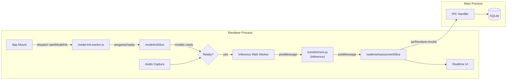

# Realtime Interview Assessment Pipeline (with WASM Pre-download)

## Context

During a live interview session, the app needs to provide real-time feedback: diarization, speaker identification, topic tracking, rambling detection, interviewer attention, and conversation flow. The existing main-process pipeline (`BuiltInPipelineOrchestrator` in `[src/backend/application/services/pipeline-orchestrator.ts](src/backend/application/services/pipeline-orchestrator.ts)`) is event-sourced and lease-based, designed for sequential stage execution -- not suitable for low-latency streaming. This plan introduces a **separate lightweight path** that runs entirely in the renderer.

`@huggingface/transformers` `^3.8.1` is already in `[package.json](package.json)` but not yet imported anywhere. In Electron, models are cached via the **browser Cache API** (persisted under `userData/Cache`). ONNX Runtime WASM binaries need explicit env setup to work reliably. Rather than loading models lazily on first inference (cold-start penalty), models are **pre-downloaded at app startup** via a dedicated init worker so inference workers can start immediately.

## Architecture




- **Model pre-download** runs in a dedicated Web Worker at app startup, caching all required ONNX models before any inference begins.
- **transformers.js inference** runs in a separate Web Worker gated on model readiness, keeping the UI thread free.
- Inference results flow to a **Redux slice** for immediate display.
- A debounced IPC call sends results to the **main process** for persistence to SQLite.
- The main-process pipeline orchestrator is **not involved** in this path.

## Key existing infrastructure to leverage

- `@huggingface/transformers` `^3.8.1` already in `[package.json](package.json)`.
- IPC pattern: shared channel constants + preload bridge + `ipcMain.handle` -- see `[src/shared/electron-app.ts](src/shared/electron-app.ts)`, `[electron/preload/index.ts](electron/preload/index.ts)`, `[electron/main/index.ts](electron/main/index.ts)`.
- Redux Toolkit store at `[src/renderer/store/store.ts](src/renderer/store/store.ts)` with slice pattern in `[src/renderer/store/slices/](src/renderer/store/slices/)`.
- Domain entities for questions (`[src/backend/domain/question/question-annotation.ts](src/backend/domain/question/question-annotation.ts)`) and participants (`[src/backend/domain/participant/participant.ts](src/backend/domain/participant/participant.ts)`).
- SQLite schema already has `question_annotation` and `participant` tables in `[src/backend/infrastructure/persistence/sqlite/schema/](src/backend/infrastructure/persistence/sqlite/schema/)`.

## Plan

### Phase A: WASM/Model Foundation

#### 1. Decide WASM threading strategy

Decide between threaded WASM (requires `SharedArrayBuffer` via COOP/COEP headers) and single-threaded WASM (`env.backends.onnx.wasm.numThreads = 1`, no special headers). **Default to single-thread** for stability; document the path to opt into threading later.

If threaded mode is needed later, inject response headers via `session.defaultSession.webRequest.onHeadersReceived` in `[electron/main/index.ts](electron/main/index.ts)`:

```
Cross-Origin-Opener-Policy: same-origin
Cross-Origin-Embedder-Policy: require-corp
```

And add matching dev-server headers in `[vite.config.ts](vite.config.ts)`.

#### 2. Create transformers.js env configuration module

New file: `src/renderer/workers/transformers-env.ts`

- `env.allowRemoteModels = true`
- `env.useWasmCache = true` (caches WASM binaries in Cache API)
- `env.cacheKey = 'isa-models-v1'` (version-namespaced cache bucket)
- `env.backends.onnx.wasm.numThreads = 1` (non-threaded default)

Imported by **both** the init worker and inference workers so they share the same cache config.

#### 3. Create model manifest

New file: `src/shared/model-manifest.ts`

Typed constant listing every model the app will use (populated after the model evaluation step):

```ts
export type ModelEntry = {
  id: string;
  task: TransformersPipelineTask;
  dtype: string;
  priority: 'required' | 'optional';
  label: string;
};

export const MODEL_MANIFEST: ModelEntry[] = [
  // populated after model-matrix evaluation
];
```

#### 4. Evaluate transformers.js model capabilities

Produce a model matrix for in-browser speech-to-text, diarization, text classification, and engagement detection. For each candidate: model name, task, size, quantization level, expected latency per chunk. Populate `MODEL_MANIFEST` entries. This determines what can run in-browser vs. what falls back to main process.

#### 5. Create model init worker (pre-download)

New file: `src/renderer/workers/model-init.worker.ts`

- On `start` message: imports `transformers-env.ts`, iterates `MODEL_MANIFEST`:
  - Calls `ModelRegistry.is_cached_files(entry.id, { dtype: entry.dtype })` to check cache
  - If not cached: calls `pipeline(entry.task, entry.id, { dtype: entry.dtype, progress_callback })` to download
  - Reports per-model progress and completion via `postMessage`
- On completion: sends a `ready` message
- Exports typed message protocol: `ModelInitWorkerRequest | ModelInitWorkerResponse`
- Bundled by Vite: `new Worker(new URL('./model-init.worker.ts', import.meta.url), { type: 'module' })`

#### 6. Create `modelInitSlice` Redux slice

New file: `src/renderer/store/slices/modelInitSlice.ts`

```ts
type ModelInitState = {
  status: 'idle' | 'checking' | 'downloading' | 'ready' | 'error';
  models: Record<string, {
    status: 'pending' | 'cached' | 'downloading' | 'ready' | 'error';
    progress: number; // 0-100
    error?: string;
  }>;
  errorMessage?: string;
};
```

- `startModelInit` thunk: spawns init worker, dispatches progress updates
- `cancelModelInit` action: terminates worker if needed
- Registered in `[src/renderer/store/store.ts](src/renderer/store/store.ts)`

#### 7. Trigger init on app mount

In `src/renderer/App.tsx` (or top-level effect), dispatch `startModelInit()` once on mount. The UI shows a lightweight status indicator driven by `modelInitSlice.status`.

#### 8. Vite config: WASM file serving

Update `[vite.config.ts](vite.config.ts)`:

- Confirm ONNX `.wasm` files are served correctly; `env.backends.onnx.wasm.wasmPaths` may need `'/'` to resolve from Vite public root.
- Add COOP/COEP dev-server headers (commented out by default, enabled when opting into threaded WASM).

### Phase B: Realtime Inference Pipeline

#### 9. Set up inference Web Worker

New directory: `src/renderer/workers/`

- Create the inference worker entry (separate from the init worker).
- Initialize `pipeline()` from `@huggingface/transformers` inside the worker (models already cached from Phase A -- no download latency).
- Define typed message protocol (request/response) between renderer main thread and worker.
- Handle model lifecycle (loading from cache, ready state, errors) and expose via Redux.

#### 10. Define realtime signal types and annotation schema

- Create domain types for realtime signals (topic, attention score, rambling indicator, speaker turns) in `src/shared/realtime-signals.ts`.
- Add a SQLite table for realtime signal annotations: `{ sessionId, chunkId, signalType, startAt, endAt, value, confidence, metadata }`.
- Distinct from the existing `question_annotation` table.

#### 11. Create IPC channels for realtime signal persistence

- Define channel constants (e.g., `REALTIME_SIGNAL_CHANNELS`) in `src/shared/` following the pattern in `[src/shared/ai-provider.ts](src/shared/ai-provider.ts)`.
- Add preload bridge methods in `[electron/preload/index.ts](electron/preload/index.ts)` under a new `realtimeSignals` bridge.
- Register `ipcMain.handle` handlers in `[electron/main/index.ts](electron/main/index.ts)` that write to SQLite via a repository.

#### 12. Create `realtimeAssessmentSlice` Redux slice

New file: `src/renderer/store/slices/realtimeAssessmentSlice.ts`

- State: current topic, attention score, rambling indicator, speaker turns, conversation flow metrics, model loading status.
- Async thunks: starting/stopping the inference worker, receiving signal updates, persisting snapshots via IPC.
- **Gates inference worker start on `modelInitSlice.status === 'ready'`**.
- Registered in `[src/renderer/store/store.ts](src/renderer/store/store.ts)`.

#### 13. Route audio chunks to inference worker

- Define how captured audio chunks (from the existing `MediaChunk` capture flow) are fed to the inference Web Worker.
- Tap into `sessionLifecycleEvents.onChunkRegistered` to forward chunk data to the worker.
- Input contract: chunk binary/path, metadata (recordedAt, source, sessionId).

#### 14. Create IPC for question detection events

- When the realtime model detects a question, emit through IPC.
- Leverage existing `QuestionAnnotationEntity` shape and `question_annotation` SQLite table.
- New IPC channel writes to existing `QuestionAnnotationRepository`.

### Phase C: Observability and Testing

#### 15. Resource usage logging and feasibility evaluation

Must be viable on typical laptops (integrated GPU, 8-16 GB RAM):

- **Renderer:** `performance.memory` for JS heap; Web Worker message throughput.
- **Web Worker:** per-inference timing around `pipeline()` calls, model load time, peak memory.
- **Main process:** `process.memoryUsage()` for RSS/heap; `app.getGPUInfo('complete')` for GPU memory.
- **Aggregate:** periodic resource snapshots via IPC. Thresholds: heap > 512 MB or inference latency > 2s triggers warning.
- Toggleable via dev/debug mode.

#### 16. Init status IPC (optional, low priority)

Once all models are `ready`, optionally notify main process via `MODEL_INIT_CHANNELS.ready` IPC -- useful for gating session-start if models are still downloading.

#### 17. Unit tests (TDD)

- Init worker message protocol and cache-check logic
- Inference worker message protocol (mock `postMessage`)
- `modelInitSlice` reducers and thunks (progress, ready, error transitions)
- `realtimeAssessmentSlice` reducers and thunks (signal state transitions)
- IPC persistence handlers (signal writes to SQLite)
- Chunk-to-worker routing logic

## Key new files

- `src/shared/model-manifest.ts` -- typed model list
- `src/renderer/workers/transformers-env.ts` -- shared transformers.js env config
- `src/renderer/workers/model-init.worker.ts` -- pre-download init worker
- `src/renderer/workers/inference.worker.ts` -- realtime inference worker
- `src/renderer/store/slices/modelInitSlice.ts` -- init state Redux slice
- `src/renderer/store/slices/realtimeAssessmentSlice.ts` -- realtime signals Redux slice
- `src/shared/realtime-signals.ts` -- domain types for realtime signals

