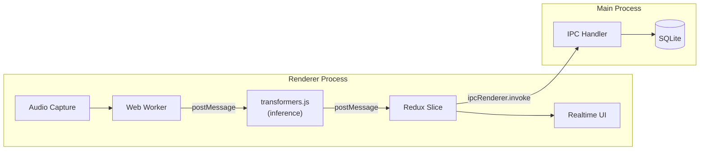

# Realtime Interview Assessment Pipeline

## Context

During a live interview session, the app needs to provide real-time feedback: diarization, speaker identification, topic tracking, rambling detection, interviewer attention, and conversation flow. The existing main-process pipeline (`BuiltInPipelineOrchestrator` in `[src/backend/application/services/pipeline-orchestrator.ts](src/backend/application/services/pipeline-orchestrator.ts)`) is event-sourced and lease-based, designed for sequential stage execution -- not suitable for low-latency streaming. This plan introduces a **separate lightweight path** that runs in the renderer.

## Architecture

- **transformers.js** runs inside a **Web Worker** in the renderer to avoid blocking the UI thread.
- Inference results flow to a **Redux slice** for immediate display.
- A debounced IPC call sends results to the **main process** for persistence to SQLite.
- The main-process pipeline orchestrator is **not involved** in this path.

## Key existing infrastructure to leverage

- `@huggingface/transformers` `^3.8.1` already in `[package.json](package.json)` (not yet imported anywhere).
- IPC pattern: shared channel constants + preload bridge + `ipcMain.handle` -- see `[src/shared/electron-app.ts](src/shared/electron-app.ts)`, `[electron/preload/index.ts](electron/preload/index.ts)`, `[electron/main/index.ts](electron/main/index.ts)`.
- Redux Toolkit store at `[src/renderer/store/store.ts](src/renderer/store/store.ts)` with slice pattern in `[src/renderer/store/slices/](src/renderer/store/slices/)`.
- Domain entities for questions (`[src/backend/domain/question/question-annotation.ts](src/backend/domain/question/question-annotation.ts)`) and participants (`[src/backend/domain/participant/participant.ts](src/backend/domain/participant/participant.ts)`) already model the relevant domain concepts.
- SQLite schema already has `question_annotation` and `participant` tables in `[src/backend/infrastructure/persistence/sqlite/schema/](src/backend/infrastructure/persistence/sqlite/schema/)`.

## Plan

### 1. Evaluate transformers.js capabilities and select models

Determine which models from the Hugging Face hub are suitable for running in-browser via `@huggingface/transformers` for:

- Speech-to-text / chunked transcription (Whisper variants)
- Speaker diarization / voice activity detection
- Text classification (topic detection, rambling/off-topic signals)
- Sentiment / engagement signals

Produce a model matrix: model name, task, size, quantization level, expected latency per chunk. This determines what can realistically run in-browser vs. what might need to fall back to the main process or be deferred.

### 2. Set up transformers.js Web Worker infrastructure

- Create a dedicated Web Worker entry under `src/renderer/workers/` (new directory, following renderer organization).
- Initialize the `pipeline()` from `@huggingface/transformers` inside the worker.
- Define a typed message protocol (request/response) between the renderer main thread and the worker.
- Handle model loading lifecycle (download progress, ready state, errors) and expose it to the UI via Redux.

### 3. Define realtime signal types and annotation schema

- Create domain types for realtime signals (topic, attention score, rambling indicator, speaker turns) in `src/backend/domain/` or a new `src/shared/realtime-signals.ts` shared module.
- Extend or add a SQLite table for realtime signal annotations -- distinct from the existing `question_annotation` table. Each row is tied to a `sessionId`, `chunkId`, timestamp range, and signal type/value.
- Define the annotation schema shape: `{ sessionId, chunkId, signalType, startAt, endAt, value, confidence, metadata }`.

### 4. Create IPC channels for realtime signal persistence

- Define channel constants (e.g., `REALTIME_SIGNAL_CHANNELS`) in `src/shared/` following the pattern in `[src/shared/ai-provider.ts](src/shared/ai-provider.ts)`.
- Add preload bridge methods in `[electron/preload/index.ts](electron/preload/index.ts)` under a new `realtimeSignals` bridge.
- Register `ipcMain.handle` handlers in `[electron/main/index.ts](electron/main/index.ts)` that write to the new SQLite table via a repository.

### 5. Create Redux slice for realtime assessment state

- New slice at `src/renderer/store/slices/realtimeAssessmentSlice.ts`.
- State shape: current topic, attention score, rambling indicator, speaker turns, conversation flow metrics, model loading status.
- Async thunks for: starting/stopping the worker, receiving signal updates, persisting snapshots via IPC.
- Register in `[src/renderer/store/store.ts](src/renderer/store/store.ts)`.

### 6. Create request structure: audio chunk to model

- Define how captured audio chunks (from the existing `MediaChunk` capture flow) are fed to the Web Worker.
- The renderer already receives media chunk events via `sessionLifecycleEvents` -- tap into `onChunkRegistered` to forward chunk data (or a reference) to the worker.
- Define the input contract: chunk binary/path, metadata (recordedAt, source, sessionId).

### 7. Create IPC for question detection events

- When the realtime model detects a question being asked, emit an event through IPC.
- Leverage the existing `QuestionAnnotationEntity` shape and `question_annotation` SQLite table.
- Add a new IPC channel for question detection that writes to the existing `QuestionAnnotationRepository`.

### 8. Resource usage logging and feasibility evaluation

A key success criterion: the realtime pipeline must be viable on typical laptops (integrated GPU, 8-16 GB RAM). Add instrumented logging to measure resource pressure during inference:

- **Renderer process:** Use `performance.memory` (Chromium-only API, available in Electron) to log JS heap size at intervals during inference. Log Web Worker message throughput (messages/sec, payload sizes).
- **Web Worker:** Log per-inference timing (`performance.now()` around `pipeline()` calls), model load time, and peak memory after model initialization.
- **Main process:** Use `process.memoryUsage()` (Node.js) to log RSS, heap total/used, and external memory. Use Electron's `app.getGPUInfo('complete')` to capture GPU memory availability.
- **Aggregate:** Emit periodic resource snapshots (every N seconds or every M chunks) via IPC to a lightweight log (file or SQLite table). Include: timestamp, heap used, heap total, RSS, GPU memory (if available), active model count, inference latency p50/p95.
- **Thresholds:** Define warning thresholds (e.g., heap > 512 MB, inference latency > 2s per chunk) that trigger a log warning and could inform the UI (e.g., "high resource usage" indicator).
- This logging should be toggleable (dev/debug mode) and must not itself become a performance burden.

### 9. Unit tests (TDD) for streaming capture and response

- Test the Web Worker message protocol (mock `postMessage`).
- Test the Redux slice reducers and thunks (signal state transitions).
- Test IPC persistence handlers (signal writes to SQLite).
- Test the chunk-to-worker routing logic.

