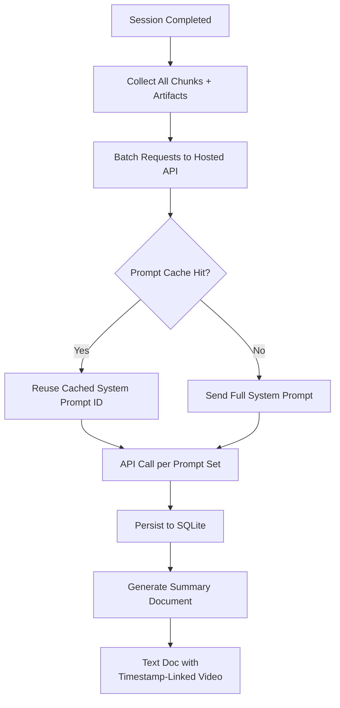

# Summary Assessment Pipeline

## Context

After an interview session completes, the app evaluates the full recording by making batch requests to hosted AI providers. The output is a structured text document linking insights to timestamped video segments. The existing pipeline already defines the post-session stages (`session.summary.requested`, `coaching.requested`) and hosted analysis adapters, but the adapters currently return **stub/placeholder data** -- they do not make real API calls. This plan wires up real hosted inference, adds prompt caching, and builds the document generation output.

## Architecture

- Triggered when session transitions to `completed` (after `coaching.requested` stage finishes in the existing pipeline).
- Leverages the existing `HostedAnalysisAdapter` contract and `StaticHostedAnalysisStageRouter`.
- Adds a **prompt caching layer** between the adapter and the API to reduce cost and latency on repeated system prompts.
- Produces a final document artifact persisted alongside the session.

## Key existing infrastructure to leverage

- **Hosted analysis adapters** (`[src/backend/infrastructure/providers/openai/openai-hosted-analysis-adapter.ts](src/backend/infrastructure/providers/openai/openai-hosted-analysis-adapter.ts)`, `[src/backend/infrastructure/providers/google/google-hosted-analysis-adapter.ts](src/backend/infrastructure/providers/google/google-hosted-analysis-adapter.ts)`) implement `HostedAnalysisAdapter` with four methods: `analyzeChunk`, `condenseContext`, `synthesizeSession`, `generateCoaching`. Currently return synthetic outputs -- need to wire real API calls.
- `**HostedAnalysisAdapter` contract** (`[src/backend/application/ports/analysis-provider.ts](src/backend/application/ports/analysis-provider.ts)`) with typed request/response per stage and `HostedAnalysisMetadata` (tokens, latency, cost).
- `**StaticHostedAnalysisStageRouter`** (`[src/backend/infrastructure/providers/hosted-analysis-stage-router.ts](src/backend/infrastructure/providers/hosted-analysis-stage-router.ts)`) maps stage names to adapters with a default fallback.
- **Pipeline orchestrator** (`[src/backend/application/services/pipeline-orchestrator.ts](src/backend/application/services/pipeline-orchestrator.ts)`) already runs `session.summary.requested` and `coaching.requested` stages, calling `LocalPipelineAnalysisProvider.executeStage()` which delegates to the router.
- `**fetchJsonOrThrow` pattern** in `[src/backend/application/use-cases/list-ai-provider-models.ts](src/backend/application/use-cases/list-ai-provider-models.ts)` -- the only existing HTTP helper. Injects `fetch` for testability.
- **Secret store** (`[src/backend/infrastructure/config/](src/backend/infrastructure/config/)`) already manages API keys per provider.
- **Pipeline artifact system** -- `PIPELINE_ARTIFACT_KINDS` and `PIPELINE_ARTIFACT_HANDOFF_RULES` in `[src/shared/pipeline.ts](src/shared/pipeline.ts)` define how artifacts flow between stages. `collectSessionArtifacts` in `[src/backend/application/services/pipeline-events.ts](src/backend/application/services/pipeline-events.ts)` gathers all output artifacts for a session.
- **Session storage layout** -- artifacts are written to disk paths resolved via `SessionStorageLayoutResolver`.
- **Interview analysis tool definitions** in `[src/shared/interview-analysis-tool-definitions.ts](src/shared/interview-analysis-tool-definitions.ts)` define JSON schemas for analysis tasks (attention, rambling, gradable tasks).

## Plan

### 1. Wire real API calls into hosted analysis adapters

Replace the synthetic stub outputs in the OpenAI and Google adapters with actual HTTP calls:

- Extract the existing `fetchJsonOrThrow` helper from `list-ai-provider-models.ts` into a shared request utility (e.g., `src/backend/infrastructure/providers/fetch-utils.ts`) so both the model listing use case and the analysis adapters can use it.
- For OpenAI: call the Chat Completions API with structured output (JSON mode or function calling) using the request's `inputArtifacts` as context.
- For Google: call the Generative Language API with equivalent structured output.
- Inject `fetch` into adapters (same DI pattern as `list-ai-provider-models`).
- Populate `HostedAnalysisMetadata` from real response headers (token counts, latency).

### 2. Create prompt caching handler

Implement a caching layer for system prompts sent to hosted APIs:

- **Storage:** New SQLite table or key-value store mapping `{ provider, promptHash }` to `{ cachedPromptId, expiresAt }`. Providers like OpenAI and Anthropic support server-side prompt caching that returns a cache ID -- store and reuse it.
- **Interface:** `PromptCachePort` with `get(provider, promptHash)` and `set(provider, promptHash, cachedPromptId, ttl)`.
- **Integration point:** The adapter checks the cache before each API call. If a cached system prompt ID exists and hasn't expired, it sends the cached reference instead of the full system prompt text.
- **Invalidation:** TTL-based expiration aligned with provider cache lifetimes (OpenAI: ~1 hour, Anthropic: ~5 minutes idle).

### 3. Evaluate and optimize SQLite usage for batch reads

- Profile queries that read all chunks, pipeline events, and artifacts for a completed session. The `collectSessionArtifacts` function walks all events -- ensure this is indexed efficiently.
- Evaluate whether the existing `idx_media_chunk_session_id` and `pipeline_event` indexes are sufficient for batch reads, or if composite indexes are needed.
- Consider whether summary results warrant a new table (e.g., `session_summary`) or can be stored as pipeline artifacts on disk (current pattern).

### 4. Design prompt sets and structured output schemas

- Define the system and user prompt templates for each batch assessment task: overall performance summary, question-by-question evaluation, communication quality, technical depth.
- Define Zod schemas for the expected structured output from each prompt (following the pattern in `[src/shared/types/models.types.ts](src/shared/types/models.types.ts)`).
- Prompts should reference the interview analysis tool definitions in `[src/shared/interview-analysis-tool-definitions.ts](src/shared/interview-analysis-tool-definitions.ts)` for consistent output shape.

### 5. Build summary document generator

- After all batch API responses are collected, generate a text document (Markdown) that:
  - Summarizes overall interview performance.
  - Links each insight to a timestamp range in the source video (using `startAt`/`endAt` from chunks and annotations).
  - Includes per-question evaluation with links to the video segment where the question was asked/answered.
- The document is saved as a pipeline artifact (`artifactKind: "summary-document"` or similar) under the session storage layout.
- Add a new artifact kind to `PIPELINE_ARTIFACT_KINDS` in `[src/shared/pipeline.ts](src/shared/pipeline.ts)` if needed.

### 6. Create IPC and Redux state for interview feedback display

- Define IPC channels for retrieving the summary document and structured feedback from the main process.
- Add preload bridge methods (e.g., `interviewFeedback.getSummary(sessionId)`).
- Create a Redux slice or extend the session recording slice to hold the summary assessment state for display in the UI.

### 7. Unit tests for batch processing and document generation

- Test adapter API call construction (mock `fetch`, verify request body shape, headers, prompt cache usage).
- Test prompt cache get/set/expiration logic.
- Test document generation: given a set of API responses and chunk metadata, verify the output document structure and timestamp links.
- Test the end-to-end flow from session completion through document output (integration-level, using in-memory SQLite).

